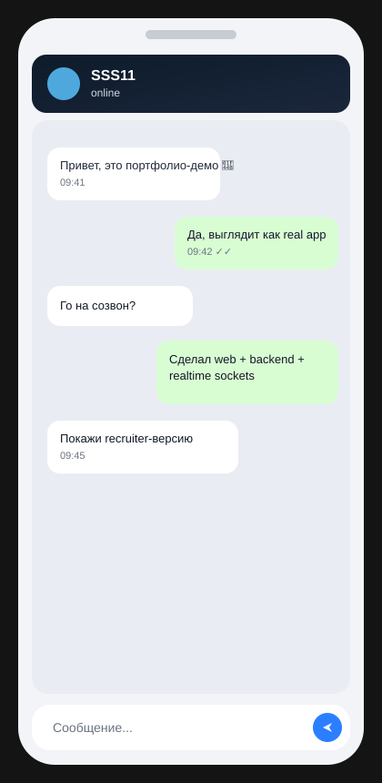
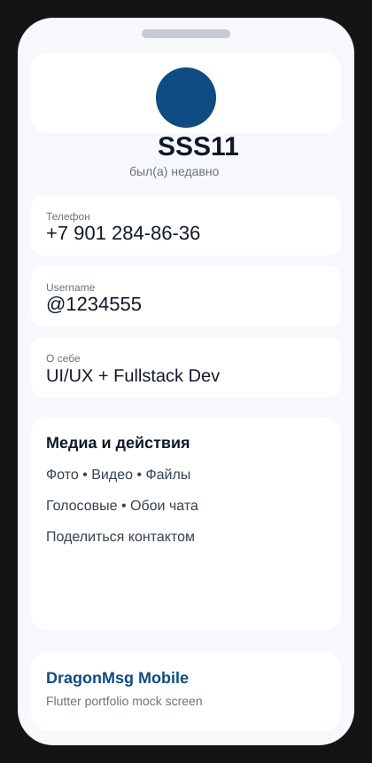

# 🚀 DragonMsg — Messenger Portfolio

Telegram-style messenger project with **web + backend + realtime + mobile direction**.

## ✨ Highlights

- ⚡ Realtime messaging via `REST + WebSocket (Socket.io)`
- 🔐 Auth flow: phone + code
- 💬 Core chat domain: users, chats, messages, attachments
- 🧩 Clean split: `backend` / `web` / `deploy`
- 🛠️ Production mindset: env setup, VPS + Nginx deployment docs

## 🧱 Tech Stack

- **Frontend:** React, TypeScript, Vite
- **Backend:** Node.js, Express, Socket.io
- **Mobile direction:** Flutter
- **Data layer:** in-memory + PostgreSQL-ready abstraction
- **Infra:** Docker, Nginx, VPS scripts

## 🧪 Product Scope

- Auth (`request-code`, `verify`)
- Profile read/update
- Chat list and chat creation
- Message history and message send
- Realtime message delivery event
- Attachment-ready message payloads

## 🖼️ Screenshots

### Web

### Mobile-style visuals

## 📦 Public Format

This public portfolio repo contains:

- Architecture and case study
- API scope summary
- Engineering decisions
- Safe snippets only

Full source code is intentionally private (IP protection), but available via private review.

## 🤝 For Recruiters

- Live private walkthrough available
- Deep-dive into architecture decisions available
- Can explain scaling path (PostgreSQL, media storage, socket scaling)

---

### CV one-liner

Built and shipped a Telegram-style messenger platform with realtime transport, modular backend APIs, and deployment-ready infrastructure docs; public portfolio published with architecture and verified UI proof.
